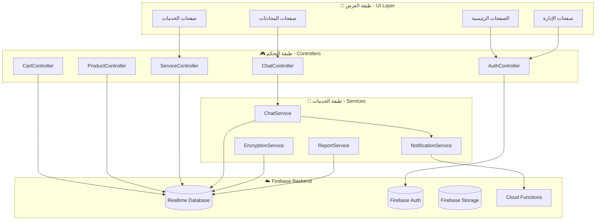
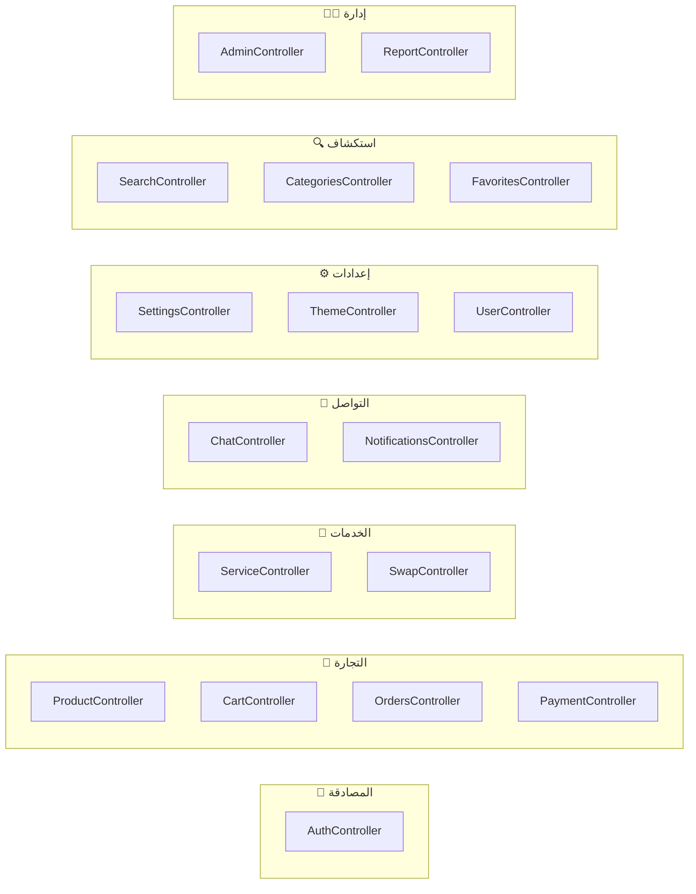
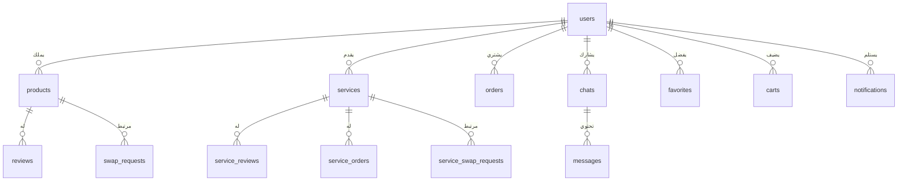
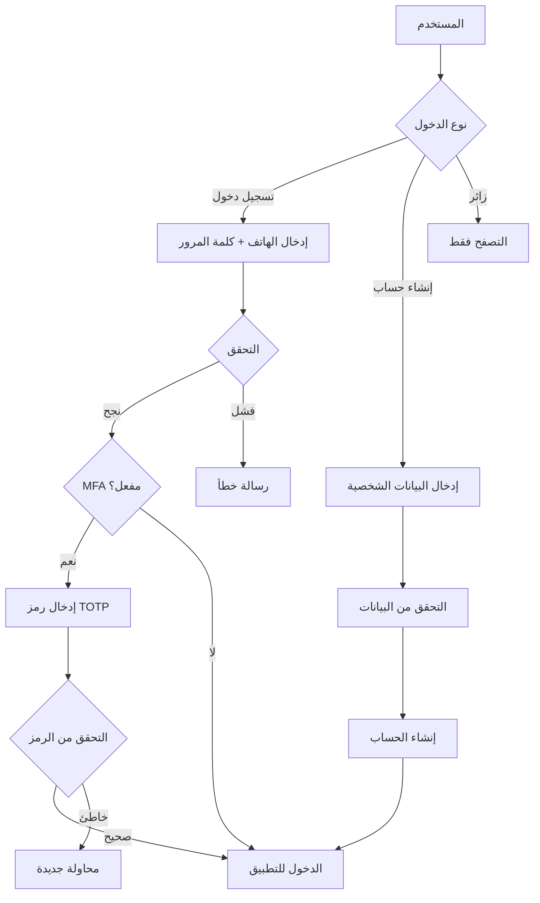
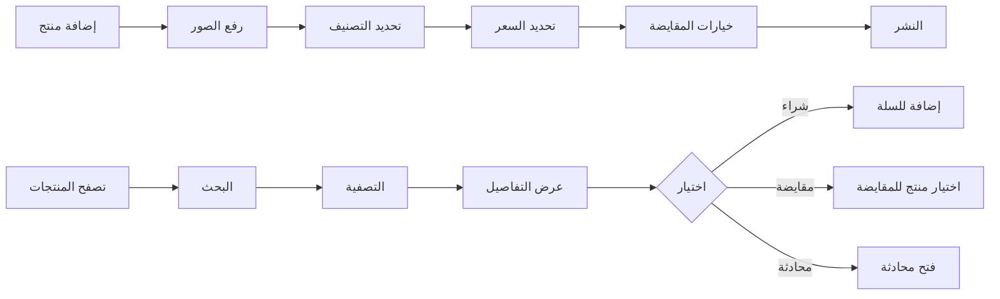
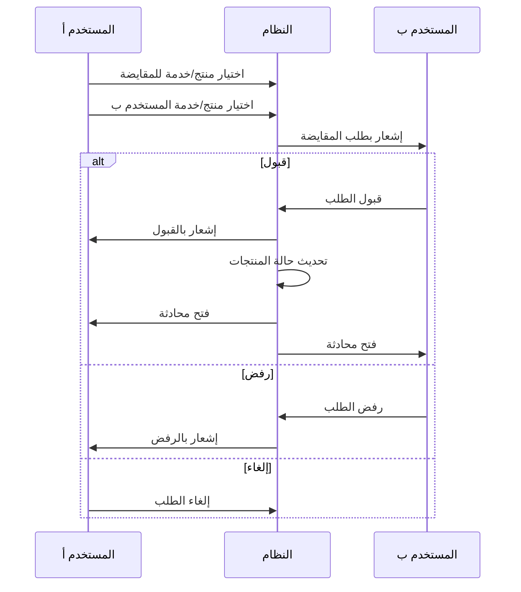
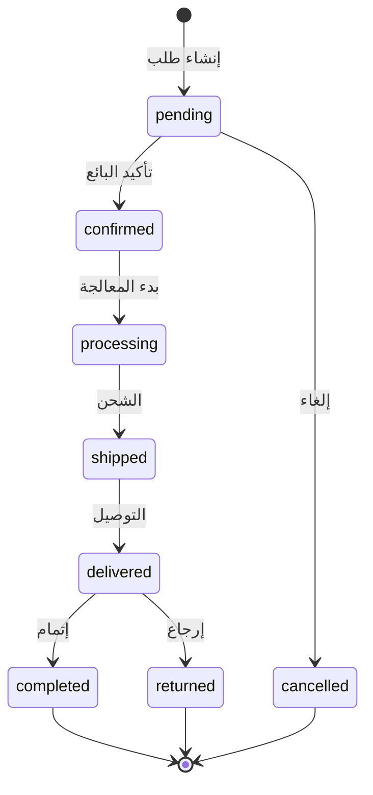

# 📱 مشروع RedSea - توثيق شامل للنظام

## 📋 نظرة عامة على المشروع

**RedSea** هو تطبيق تجارة إلكترونية متكامل مبني بـ Flutter مع Firebase كخلفية. يوفر التطبيق منصة لتبادل وبيع المنتجات والخدمات مع دعم كامل للغة العربية.

---

## 🏗️ هيكلة النظام



---

## 📂 هيكلة المجلدات

```
📁 Redsea/
├── 📁 lib/                          # الكود الرئيسي للتطبيق
│   ├── 📄 main.dart                 # نقطة الدخول للتطبيق
│   ├── 📄 homepage.dart             # الصفحة الرئيسية (2012 سطر)
│   ├── 📄 login.dart                # صفحة تسجيل الدخول
│   ├── 📄 signup.dart               # صفحة التسجيل
│   ├── 📄 firstpage.dart            # صفحة الترحيب
│   │
│   ├── 📁 app/                      # بنية GetX
│   │   ├── 📁 bindings/             # ربط الـ Controllers (17 ملف)
│   │   ├── 📁 controllers/          # المتحكمات (17 ملف)
│   │   ├── 📁 core/                 # الثوابت والثيمات
│   │   ├── 📁 models/               # نماذج البيانات
│   │   ├── 📁 routes/               # التوجيه (29 مسار)
│   │   ├── 📁 ui/                   # مكونات واجهة المستخدم
│   │   └── 📁 utils/                # أدوات مساعدة
│   │
│   ├── 📁 services/                 # خدمات التطبيق
│   │   ├── 📄 chat_service.dart     # خدمة المحادثات المشفرة
│   │   ├── 📄 encryption_service.dart # خدمة التشفير
│   │   ├── 📄 notification_service.dart # خدمة الإشعارات
│   │   ├── 📄 mfa_service.dart      # خدمة المصادقة الثنائية
│   │   ├── 📄 report_service.dart   # خدمة التقارير
│   │   └── 📄 ...                   # خدمات أخرى
│   │
│   ├── 📁 services_exchange/        # نظام تبادل الخدمات
│   ├── 📁 admin/                    # لوحة تحكم المدير
│   ├── 📁 chat/                     # نظام المحادثات
│   ├── 📁 auth/                     # المصادقة الثنائية MFA
│   ├── 📁 reports/                  # نظام التقارير
│   ├── 📁 models/                   # نماذج البيانات
│   └── 📁 utils/                    # أدوات مساعدة
│
├── 📁 android/                      # إعدادات Android
├── 📁 ios/                          # إعدادات iOS
├── 📁 web/                          # إعدادات الويب
├── 📁 windows/                      # إعدادات Windows
├── 📁 functions/                    # Firebase Cloud Functions
├── 📄 firebase.json                 # إعدادات Firebase
├── 📄 database.rules.json           # قواعد قاعدة البيانات
├── 📄 storage.rules                 # قواعد التخزين
└── 📄 pubspec.yaml                  # تبعيات المشروع
```

---

## 🔧 المكتبات والتبعيات

| المكتبة | الإصدار | الوظيفة |
|---------|---------|---------|
| `flutter` | SDK | إطار العمل الرئيسي |
| `firebase_core` | ^2.24.0 | تهيئة Firebase |
| `firebase_auth` | ^4.18.1 | المصادقة |
| `firebase_database` | ^10.3.7 | قاعدة البيانات |
| `firebase_storage` | ^11.7.7 | تخزين الملفات |
| `firebase_messaging` | ^14.9.4 | الإشعارات |
| `get` | ^4.6.6 | إدارة الحالة والتوجيه |
| `encrypt` | ^5.0.3 | تشفير الرسائل |
| `otp` | ^3.1.4 | المصادقة الثنائية TOTP |
| `pdf` | ^3.10.8 | تصدير PDF |
| `excel` | ^4.0.2 | تصدير Excel |
| `fl_chart` | ^0.69.0 | الرسوم البيانية |
| `image_picker` | ^1.1.2 | اختيار الصور |
| `audioplayers` | ^6.5.1 | تشغيل الصوت |
| `record` | ^6.0.0 | تسجيل الصوت |
| `qr_flutter` | ^4.1.0 | إنشاء QR codes |

---

## 🎮 نظام التحكم (Controllers)

### المتحكمات الرئيسية



### تفاصيل المتحكمات

| المتحكم | الملف | الوظائف الرئيسية |
|---------|-------|------------------|
| **AuthController** | `auth_controller.dart` | تسجيل الدخول، الخروج، إدارة الصلاحيات، وضع الزائر |
| **CartController** | `cart_controller.dart` | إضافة/حذف من السلة، تحديث الكميات، حفظ في Firebase |
| **ProductController** | `product_controller.dart` | عرض المنتجات، التصفية، إدارة المنتجات |
| **ServiceController** | `service_controller.dart` | إدارة الخدمات، طلبات التبادل، التقييمات |
| **ChatController** | `chat_controller.dart` | إدارة المحادثات، إرسال الرسائل المشفرة |
| **NotificationsController** | `notifications_controller.dart` | الإشعارات الفورية، قراءة/حذف |
| **OrdersController** | `orders_controller.dart` | إدارة الطلبات، تحديث الحالة |
| **SwapController** | `swap_controller.dart` | طلبات المقايضة، القبول/الرفض |
| **FavoritesController** | `favorites_controller.dart` | إدارة المفضلة |
| **PaymentController** | `payment_controller.dart` | معالجة الدفع |
| **AdminController** | `admin_controller.dart` | لوحة التحكم، الإحصائيات |
| **SearchController** | `search_controller.dart` | البحث في المنتجات والخدمات |
| **CategoriesController** | `categories_controller.dart` | إدارة التصنيفات |
| **SettingsController** | `settings_controller.dart` | إعدادات المستخدم |
| **ThemeController** | `theme_controller.dart` | تبديل الثيم (فاتح/داكن) |
| **UserController** | `user_controller.dart` | بيانات المستخدم |
| **ReportController** | `report_controller.dart` | تقارير النظام |

---

## 🛣️ نظام التوجيه (Routes)

### المسارات المتاحة (29 مسار)

```dart
// الصفحات الأساسية
splash         → '/'                    // شاشة البداية
first          → '/first'               // الصفحة الأولى
login          → '/login'               // تسجيل الدخول
signup         → '/signup'              // إنشاء حساب
home           → '/home'                // الصفحة الرئيسية

// المنتجات
productDetails → '/product-details'     // تفاصيل المنتج
addProduct     → '/add-product'         // إضافة منتج
myProducts     → '/my-products'         // منتجاتي

// السلة والدفع
basket         → '/basket'              // السلة
payment        → '/payment'             // الدفع

// الملف الشخصي
profile        → '/profile'             // الملف الشخصي
settings       → '/settings'            // الإعدادات
publicProfile  → '/public-profile'      // الملف العام

// المحادثات
chatList       → '/chat-list'           // قائمة المحادثات
chat           → '/chat'                // صفحة المحادثة

// الطلبات والإشعارات
orders         → '/orders'              // الطلبات
notifications  → '/notifications'       // الإشعارات

// التصنيفات والبحث
categories     → '/categories'          // التصنيفات
search         → '/search'              // البحث
favorites      → '/favorites'           // المفضلة

// المقايضة والخدمات
swapSelection      → '/swap-selection'          // اختيار المقايضة
swapRequests       → '/swap-requests'           // طلبات المقايضة
servicesExchange   → '/services-exchange'       // تبادل الخدمات
serviceCategories  → '/service-categories'      // تصنيفات الخدمات
categoryServices   → '/category-services'       // خدمات التصنيف
serviceOrders      → '/service-orders'          // طلبات الخدمات
serviceReviews     → '/service-reviews'         // تقييمات الخدمات
serviceProviderProfile → '/service-provider-profile' // ملف مقدم الخدمة

// الإدارة
admin              → '/admin'                   // لوحة التحكم
adminFixProducts   → '/admin/fix-products'      // إصلاح المنتجات

// المصادقة الثنائية
mfaEnrollment      → '/mfa-enrollment'          // تفعيل MFA
mfaVerification    → '/mfa-verification'        // التحقق من MFA

// أخرى
onboarding         → '/onboarding'              // شاشة الترحيب
```

---

## 📊 نماذج البيانات (Models)

### نموذج المنتج (Product)

```dart
class Product {
  String id;                    // معرف المنتج
  String name;                  // اسم المنتج
  String description;           // الوصف
  String price;                 // السعر
  String? oldPrice;             // السعر القديم (للعروض)
  String category;              // التصنيف
  List<String> images;          // الصور
  String sellerId;              // معرف البائع
  String sellerName;            // اسم البائع
  int quantity;                 // الكمية
  DateTime createdAt;           // تاريخ الإنشاء
  
  // خصائص المقايضة
  bool isSwappable;             // قابل للمقايضة
  SwapType swapType;            // نوع المقايضة
  SwapStatus swapStatus;        // حالة المقايضة
  ProductCondition condition;   // حالة المنتج
  
  // الإحصائيات
  int viewsCount;               // عدد المشاهدات
  int salesCount;               // عدد المبيعات
  double rating;                // التقييم
  int reviewsCount;             // عدد التقييمات
  bool isFeatured;              // منتج مميز
  bool isSpecialOffer;          // عرض خاص
  
  // معلومات الدفع
  String? paymentMethod;        // طريقة الدفع
  String? paymentAccountNumber; // رقم الحساب
  String? paymentAccountName;   // اسم صاحب الحساب
  String? paymentInstructions;  // تعليمات الدفع
}
```

### أنواع التعداد (Enums)

```dart
// أنواع المقايضة
enum SwapType {
  productProduct,   // منتج مقابل منتج
  productService,   // منتج مقابل خدمة
  serviceService,   // خدمة مقابل خدمة
}

// حالة المنتج
enum ProductCondition {
  newSealed,       // جديد مغلف
  newOpen,         // جديد مفتوح
  usedExcellent,   // مستعمل - ممتاز
  usedGood,        // مستعمل - جيد
  usedFair,        // مستعمل - متوسط
}

// حالة المقايضة
enum SwapStatus {
  available,       // متاح
  inSwap,          // قيد التفاوض
  swapped,         // تمت المقايضة
}

// مستوى البائع
enum SellerLevel {
  beginner,        // مبتدئ
  intermediate,    // محترف
  expert,          // خبير
}
```

### نموذج الخدمة (Service)

```dart
class Service {
  String id;                     // معرف الخدمة
  String ownerId;                // معرف صاحب الخدمة
  String ownerName;              // اسم صاحب الخدمة
  String title;                  // عنوان الخدمة
  String description;            // الوصف
  String category;               // التصنيف
  double estimatedValue;         // القيمة التقديرية
  String duration;               // المدة
  List<String> images;           // الصور
  List<String> swapPreferences;  // تفضيلات التبادل
  bool isAvailable;              // متاح
  SellerLevel sellerLevel;       // مستوى البائع
  double rating;                 // التقييم
  int reviewsCount;              // عدد التقييمات
  int completedOrders;           // الطلبات المكتملة
  int viewsCount;                // المشاهدات
  DateTime createdAt;            // تاريخ الإنشاء
  bool isSpecialOffer;           // عرض خاص
  double? oldEstimatedValue;     // القيمة القديمة

  // معلومات الدفع
  String? paymentMethod;
  String? paymentAccountNumber;
  String? paymentAccountName;
  String? paymentInstructions;
}
```

### نموذج تقييم الخدمة (ServiceReview)

```dart
class ServiceReview {
  String id;              // معرف التقييم
  String serviceId;       // معرف الخدمة
  String userId;          // معرف المستخدم
  String userName;        // اسم المستخدم
  double rating;          // التقييم (1-5)
  String comment;         // التعليق
  DateTime timestamp;     // الوقت
}
```

### نموذج طلب تبادل الخدمات (ServiceSwapRequest)

```dart
class ServiceSwapRequest {
  String id;                    // معرف الطلب
  String requesterId;           // معرف الطالب
  String requesterName;         // اسم الطالب
  String requesterServiceId;    // معرف خدمة الطالب
  String requesterServiceTitle; // عنوان خدمة الطالب
  String targetOwnerId;         // معرف صاحب الخدمة المستهدفة
  String targetOwnerName;       // اسم صاحب الخدمة المستهدفة
  String targetServiceId;       // معرف الخدمة المستهدفة
  String targetServiceTitle;    // عنوان الخدمة المستهدفة
  String status;                // الحالة (pending/accepted/rejected/cancelled)
  String message;               // رسالة الطلب
  String? rejectionReason;      // سبب الرفض
  DateTime timestamp;           // الوقت
}
```

---

## ☁️ قاعدة البيانات (Firebase Realtime Database)

### هيكل قاعدة البيانات



### العقد الرئيسية في قاعدة البيانات

| العقدة | الوصف | القواعد |
|--------|-------|---------|
| `users` | بيانات المستخدمين | للقراءة: مسجل الدخول، للكتابة: المالك أو الأدمن |
| `user_lookup` | جدول البحث عن المستخدمين | للقراءة: الجميع، للكتابة: مسجل الدخول |
| `products` | المنتجات | للقراءة: الجميع، للكتابة: المالك أو الأدمن |
| `services` | الخدمات | للقراءة: الجميع، للكتابة: المالك أو الأدمن |
| `orders` | الطلبات | للقراءة/الكتابة: المشتري أو البائع أو الأدمن |
| `service_orders` | طلبات الخدمات | للقراءة/الكتابة: المشتري أو البائع أو الأدمن |
| `chats` | المحادثات | للقراءة/الكتابة: المشاركين في المحادثة |
| `messages` | الرسائل | للقراءة/الكتابة: مسجل الدخول |
| `favorites` | المفضلة | للقراءة/الكتابة: المالك فقط |
| `carts` | سلات التسوق | للقراءة/الكتابة: المالك فقط |
| `service_carts` | سلات الخدمات | للقراءة/الكتابة: المالك فقط |
| `notifications` | الإشعارات | للقراءة: المالك، للكتابة: مسجل الدخول |
| `swap_requests` | طلبات المقايضة | للقراءة/الكتابة: الطالب أو المستهدف أو الأدمن |
| `service_swap_requests` | طلبات تبادل الخدمات | للقراءة/الكتابة: الطالب أو المستهدف أو الأدمن |
| `reviews` | التقييمات | للقراءة: الجميع، للكتابة: المقيّم أو الأدمن |
| `service_reviews` | تقييمات الخدمات | للقراءة: الجميع، للكتابة: المقيّم أو الأدمن |
| `categories` | التصنيفات | للقراءة: الجميع، للكتابة: مسجل الدخول |
| `reports` | التقارير | للقراءة/الكتابة: الأدمن فقط |
| `admin_dashboard` | لوحة الإدارة | للقراءة/الكتابة: الأدمن فقط |
| `mfa_settings` | إعدادات MFA | للقراءة: الجميع، للكتابة: المالك |
| `blocked_users` | المحظورين | للقراءة/الكتابة: المالك فقط |

---

## 🔐 نظام الأمان

### المصادقة (Authentication)



### مستويات الصلاحيات

| الدور | الصلاحيات |
|-------|-----------|
| **زائر** | تصفح المنتجات والخدمات فقط |
| **مستخدم** | تصفح، شراء، بيع، محادثات، مفضلة، تقييمات |
| **أدمن** | جميع صلاحيات المستخدم + لوحة التحكم، التقارير، إدارة المستخدمين، حذف أي محتوى |

### التشفير

- **رسائل المحادثات**: مشفرة باستخدام مكتبة `encrypt` (AES)
- **كلمات المرور**: مشفرة بواسطة Firebase Auth
- **رموز MFA**: توليد TOTP باستخدام مكتبة `otp`

---

## 🛒 الوظائف الرئيسية

### 1. نظام المنتجات



### 2. نظام الخدمات

- **إضافة خدمة**: مع الصور، الوصف، القيمة التقديرية، المدة
- **تصنيفات الخدمات**: تصميم، تقنية، تعليم، تسويق، ترجمة، كتابة، استشارات، تصوير، صيانة، حرف يدوية، أخرى
- **طلب خدمة**: عبر الدفع المباشر أو تبادل خدمة
- **تقييم الخدمات**: نظام تقييم 5 نجوم مع تعليقات
- **ملف مقدم الخدمة**: عرض الخدمات، التقييمات، الإحصائيات

### 3. نظام المقايضة (Swap)



### 4. نظام المحادثات

- **محادثات مشفرة**: جميع الرسائل مشفرة
- **أنواع الرسائل**: نصية، صور، صوتية، ملفات
- **الرد على الرسائل**: Reply to message
- **إشعارات فورية**: عند استلام رسالة جديدة
- **حظر المستخدمين**: إمكانية حظر المستخدمين المزعجين

### 5. نظام الطلبات



### 6. لوحة تحكم المدير

- **إحصائيات عامة**: المستخدمين، المنتجات، الخدمات، الطلبات
- **رسوم بيانية**: مبيعات، تسجيلات، نشاط
- **إدارة المحتوى**: حذف/تعديل المنتجات والخدمات
- **إدارة المستخدمين**: عرض، تعديل، حظر
- **تقارير**: تصدير PDF/Excel

### 7. نظام التقارير

- **أنواع التقارير**: يومية، أسبوعية، شهرية
- **محتوى التقارير**: مبيعات، مستخدمين جدد، منتجات، خدمات
- **تصدير**: PDF, Excel
- **رسوم بيانية**: باستخدام fl_chart

---

## 📱 الصفحات الرئيسية

| الصفحة | الملف | الوصف |
|--------|-------|-------|
| الصفحة الرئيسية | `homepage.dart` | عرض المنتجات، البحث، التصفية، العروض |
| تفاصيل المنتج | `product_details_page.dart` | عرض التفاصيل، الصور، التقييمات، أزرار الشراء/المقايضة |
| إضافة منتج | `add_product_page.dart` | نموذج إضافة منتج جديد |
| تعديل منتج | `edit_product_page.dart` | تعديل منتج موجود |
| منتجاتي | `my_products_page.dart` | عرض منتجات المستخدم |
| السلة | `basket_page.dart` | عرض السلة، تعديل الكميات، الدفع |
| الدفع | `payment_method_page.dart` | اختيار طريقة الدفع، إتمام الطلب |
| المفضلة | `favorites_page.dart` | المنتجات المفضلة |
| البحث | `search_page.dart` | البحث المتقدم |
| التصنيفات | `categories_page.dart` | عرض التصنيفات |
| الطلبات | `orders_page.dart` | طلبات المستخدم |
| الإشعارات | `notifications_page.dart` | الإشعارات |
| تسجيل الدخول | `login.dart` | نموذج الدخول |
| إنشاء حساب | `signup.dart` | نموذج التسجيل |
| الملف الشخصي | `profile_page.dart` | بيانات المستخدم |
| الإعدادات | `settings_page.dart` | إعدادات التطبيق |
| المحادثات | `chat_list_page.dart` | قائمة المحادثات |
| المحادثة | `chat_page.dart` | صفحة المحادثة |
| طلبات المقايضة | `swap_requests_page.dart` | إدارة طلبات المقايضة |
| اختيار المقايضة | `swap_selection_page.dart` | اختيار منتج للمقايضة |
| تبادل الخدمات | `services_exchange_page.dart` | منصة الخدمات |
| تفاصيل الخدمة | `service_details_page.dart` | عرض تفاصيل الخدمة |
| إضافة خدمة | `add_service_page.dart` | إضافة خدمة جديدة |
| خدماتي | `my_services_page.dart` | خدمات المستخدم |
| تقييمات الخدمة | `service_reviews_page.dart` | تقييمات الخدمة |
| لوحة التحكم | `admin_dashboard_page.dart` | لوحة الإدارة |
| التقارير | `reports_page.dart` | صفحة التقارير |
| MFA | `mfa_enrollment_page.dart` | تفعيل المصادقة الثنائية |

---

## 🔧 الخدمات (Services)

| الخدمة | الملف | الوظيفة |
|--------|-------|---------|
| **ChatService** | `chat_service.dart` | إدارة المحادثات، إرسال/استقبال الرسائل المشفرة، رفع الملفات |
| **EncryptionService** | `encryption_service.dart` | تشفير/فك تشفير الرسائل |
| **NotificationService** | `notification_service.dart` | إدارة الإشعارات الفورية |
| **InAppNotificationService** | `in_app_notification_service.dart` | إشعارات داخل التطبيق |
| **MFAService** | `mfa_service.dart` | المصادقة الثنائية TOTP |
| **ReportService** | `report_service.dart` | إنشاء وإدارة التقارير |
| **UserReportService** | `user_report_service.dart` | تقارير المستخدمين |
| **PDFExportService** | `pdf_export_service.dart` | تصدير PDF |
| **SearchService** | `search_service.dart` | خدمة البحث |
| **ImgBBService** | `imgbb_service.dart` | رفع الصور لـ ImgBB |

---

## 🎨 نظام الثيمات

### الثيم الفاتح والداكن

```dart
// lib/app/core/app_theme.dart
class AppTheme {
  static ThemeData lightTheme;  // الثيم الفاتح
  static ThemeData darkTheme;   // الثيم الداكن
}
```

### الألوان الرئيسية

- **اللون الأساسي**: أزرق (#2196F3)
- **اللون الثانوي**: متغير حسب الثيم
- **لون النجاح**: أخضر
- **لون الخطأ**: أحمر
- **لون التحذير**: برتقالي

---

## 📊 ملخص المشروع

| العنصر | العدد |
|--------|-------|
| إجمالي ملفات Dart | ~80+ |
| المتحكمات (Controllers) | 17 |
| الروابط (Bindings) | 17 |
| المسارات (Routes) | 29 |
| ملفات الخدمات | 11 |
| عقد قاعدة البيانات | 24 |
| المنصات المدعومة | 5 (Android, iOS, Web, Windows, macOS, Linux) |
| سطور الكود (تقريبي) | 15,000+ |

---

## 🚀 كيفية تشغيل المشروع

### المتطلبات

1. Flutter SDK >= 3.1.0
2. Dart SDK >= 3.1.0
3. حساب Firebase مع:
   - Authentication (Phone)
   - Realtime Database
   - Storage
   - Cloud Functions

### خطوات التشغيل

```bash
# 1. تثبيت التبعيات
flutter pub get

# 2. تشغيل التطبيق
flutter run

# 3. بناء APK
flutter build apk --release

# 4. بناء للويب
flutter build web
```

---

## 📝 ملاحظات للمطورين

1. **GetX Pattern**: المشروع يستخدم GetX لإدارة الحالة والتوجيه والتبعيات
2. **Firebase Rules**: تأكد من تحديث قواعد الأمان في `database.rules.json`
3. **التشفير**: جميع الرسائل مشفرة - تأكد من تهيئة `EncryptionService` قبل الاستخدام
4. **اللغة العربية**: التطبيق مصمم للغة العربية (RTL)
5. **الصور**: يتم رفع الصور إما لـ Firebase Storage أو ImgBB

---

## 🔄 التحديثات المستقبلية المقترحة

- [ ] إضافة دعم للغة الإنجليزية
- [ ] تحسين أداء البحث
- [ ] إضافة نظام الكوبونات
- [ ] تكامل مع بوابات دفع إلكترونية
- [ ] إضافة نظام الشحن والتتبع
- [ ] تطبيق تحليلات Firebase Analytics

---

> **تم إنشاء هذا التوثيق بتاريخ**: 2026-01-24
> 
> **الإصدار**: 1.0.0+1
